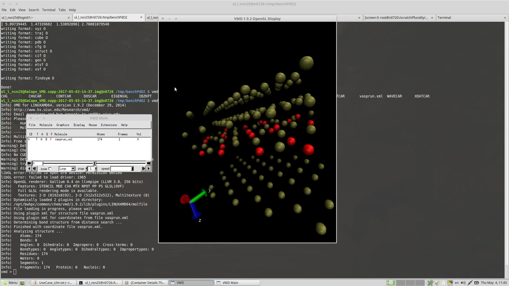

# Currently available containers on JUSTUS

Singularity container images are available under the following path: `/nfs/home1/CiTAR/images`

| Image Name | Contained Software | Accessible |
|-------|:------------------:|----------------:|
|DaCapo_VMD.sapp-2017-05-09-13-22.img|DaCapo,ASE,VMD...|everyone|
|Vasp_VMD.sapp-2017-05-11-09-50.img|VASP,VMD|licensees only|
|Gaussian_VMD.sapp-2017-05-17-11-41.img|Gaussian,VMD|licensees only|

Access is easy! Just login your ordinary justus account. Then:

    ssh n0726
    singularity exec /nfs/home1/CiTAR/images/DaCapo_VMD.sapp-2017-05-09-13-22.img /bin/bash
    ul_l_nsn25@Gaussian_VMD.sapp-2017-05-17-11-41.img@n0726 ~ $ ls $HOME /tmp /scratch /lustre/lxfs/
    (...) # these shares are available
    ul_l_nsn25@Gaussian_VMD.sapp-2017-05-17-11-41.img@n0726 ~ $ module av
    ------------------------------------------------------------------------------------------------------- /opt/bwhpc/common/modulefiles -------------------------------------------------------------------------------------------------------
    chem/dacapo/2.7.16         chem/vmd/1.9.2             compiler/intel/14.0        mpi/openmpi/1.8-intel-14.0 numlib/mkl/11.1.4
    ul_l_nsn25@Gaussian_VMD.sapp-2017-05-17-11-41.img@n0726 ~ $ /singularity
    (...) This will run a short example
    ul_l_nsn25@Gaussian_VMD.sapp-2017-05-17-11-41.img@n0726 ~ $ exit

## Customizing the container

If you have permissions you can copy the container image and customize it to your needs (install additional software/tools, include data and scripts and so on):

    me@localpc: ~ $ scp justus:/nfs/home1/CiTAR/images/DaCapo_VMD.sapp-2017-05-09-13-22.img .
    
Now you can use and modify the image as you wish and copy it later back to JUSTUS.

## Using VMD

If you want to use VMD for visualizing some results just use `-Y` for the ssh command.
Here is an example of how that might look like :)

